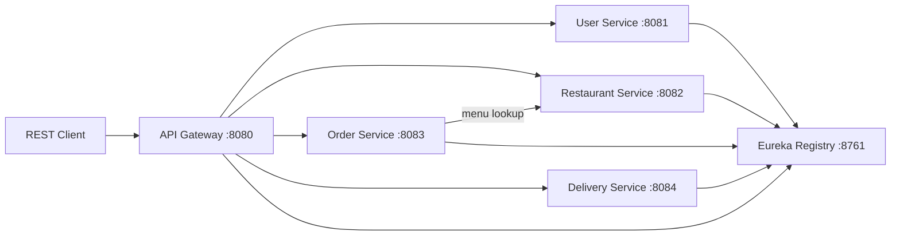

# Restaurant Management System

A microservices-based food delivery platform built with **Spring Boot 3**, **Spring Cloud**, **Gradle**, **JUnit 5**, and **JBehave**.

## Architecture



## Modules

| Module | Port | Responsibility |
|--------|------|----------------|
| `service-registry` | 8761 | Eureka service discovery |
| `api-gateway` | 8080 | Single entry point, route forwarding |
| `user-service` | 8081 | Customers, drivers, admins |
| `restaurant-service` | 8082 | Restaurants and menus |
| `order-service` | 8083 | Order placement and status |
| `delivery-service` | 8084 | Driver assignment and delivery tracking |
| `common-lib` | — | Shared DTOs |
| `bdd-tests` | — | JBehave end-to-end scenarios |

## Prerequisites

- Java 21+ (tested with Java 26)
- Gradle 9.5+ (wrapper included)

## Quick Start

### 1. Build everything

```bash
./gradlew clean build
```

### 2. Start services (separate terminals)

Start in this order:

```bash
./gradlew :service-registry:bootRun
./gradlew :user-service:bootRun
./gradlew :restaurant-service:bootRun
./gradlew :order-service:bootRun
./gradlew :delivery-service:bootRun
./gradlew :api-gateway:bootRun
```

Or use the helper script:

```bash
chmod +x scripts/start-all.sh
./scripts/start-all.sh
```

### 3. Try the API (via gateway)

**Register a customer**

```bash
curl -X POST http://localhost:8080/api/users \
  -H "Content-Type: application/json" \
  -d '{"name":"Alice","email":"alice@example.com","password":"secret1","phone":"555-0100","role":"CUSTOMER"}'
```

**Create a restaurant**

```bash
curl -X POST http://localhost:8080/api/restaurants \
  -H "Content-Type: application/json" \
  -d '{"name":"Pizza Palace","cuisine":"Italian","address":"123 Main St","rating":4.5}'
```

**Add a menu item**

```bash
curl -X POST http://localhost:8080/api/menu \
  -H "Content-Type: application/json" \
  -d '{"restaurantId":1,"name":"Margherita","description":"Classic","price":12.99,"category":"Pizza"}'
```

**Place an order**

```bash
curl -X POST http://localhost:8080/api/orders \
  -H "Content-Type: application/json" \
  -d '{"customerId":1,"restaurantId":1,"items":[{"menuItemId":1,"quantity":2}],"deliveryAddress":"42 Oak St"}'
```

**Assign delivery**

```bash
curl -X POST http://localhost:8080/api/deliveries \
  -H "Content-Type: application/json" \
  -d '{"orderId":1,"driverId":2,"notes":"Ring doorbell"}'
```

## Testing

### Unit tests (JUnit 5)

```bash
./gradlew test
```

### BDD tests (JBehave)

Start all services first, then run:

```bash
./gradlew :bdd-tests:test -Dbdd.base.url=http://localhost:8080/api
```

Reports are generated under `bdd-tests/build/reports/tests/test/` and `bdd-tests/target/jbehave-reports/`.


## Tech stack

- Spring Boot 3.4, Spring Cloud 2024
- Netflix Eureka + Spring Cloud Gateway
- Spring Data JPA + H2 (dev)
- JUnit 5 + Mockito
- JBehave + Rest Assured
- Gradle multi-module build
